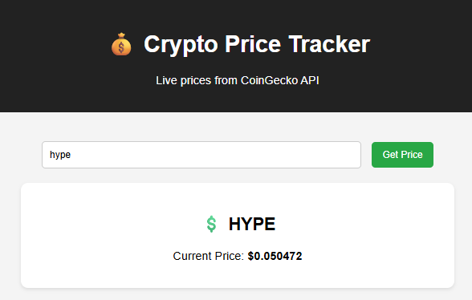

# 💰 Crypto Price Tracker

A simple web app to track **live cryptocurrency prices** using the **CoinGecko API**.  
Built with **HTML, CSS, and JavaScript**.

---

## 🚀 Features
- Search any cryptocurrency (e.g. bitcoin, ethereum, dogecoin)
- Fetches real-time USD price from CoinGecko
- Simple and clean UI
- Error handling for wrong inputs

---

## 📂 Project Structure

---

## 📸 Screenshot

---

## 🌐 Live Demo
[👉 Try it here](https://xyzvikram.github.io/crypto-price-tracker/)

---

## ⭐ Support
If you like this project, don’t forget to **star** ⭐ the repository!

---
1
2
3
4
5
6
7
8
